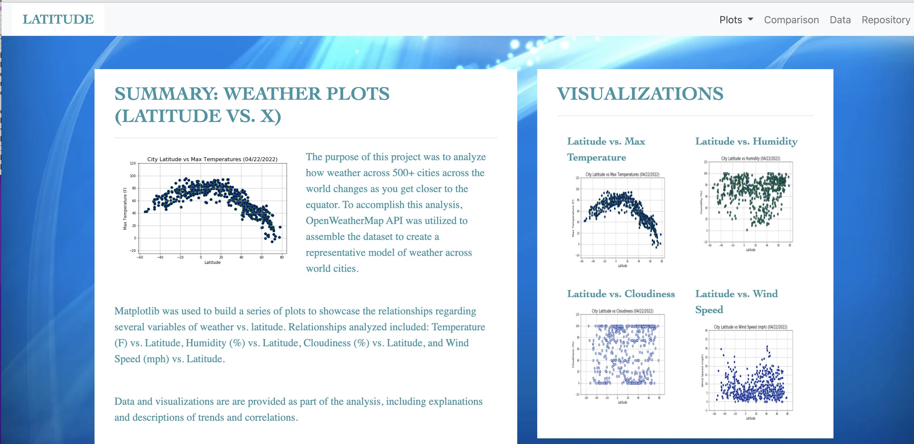
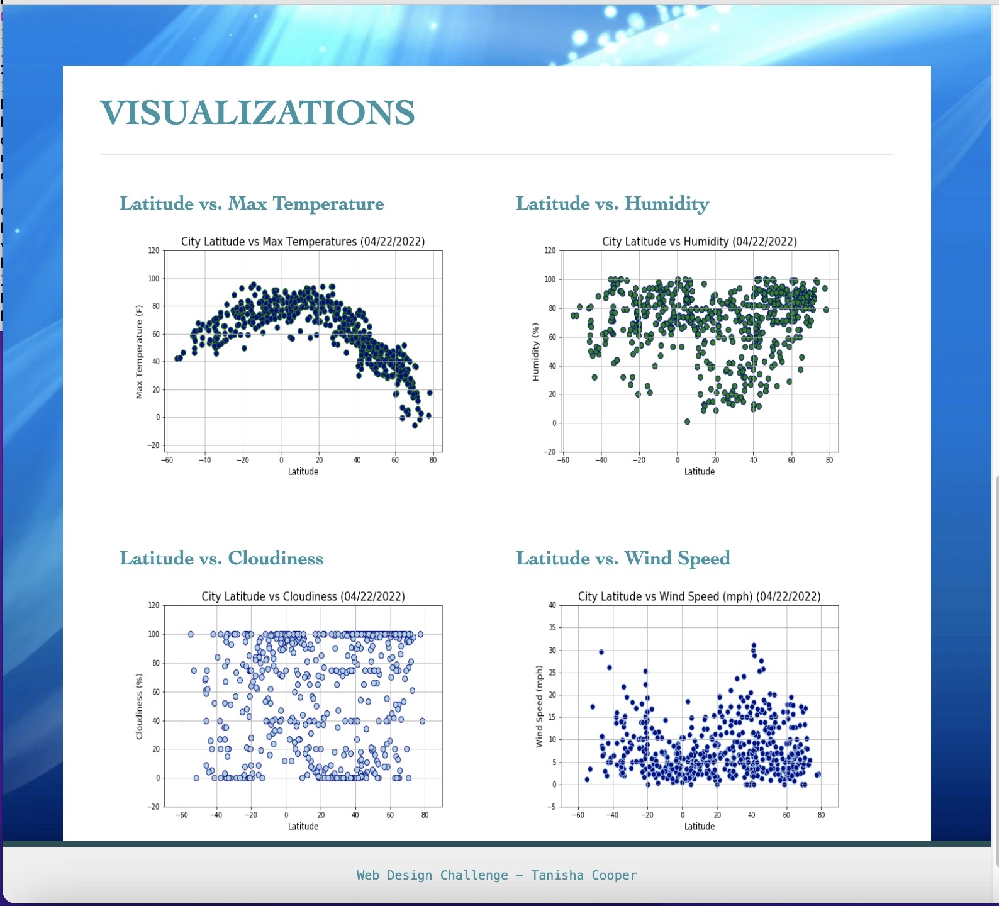
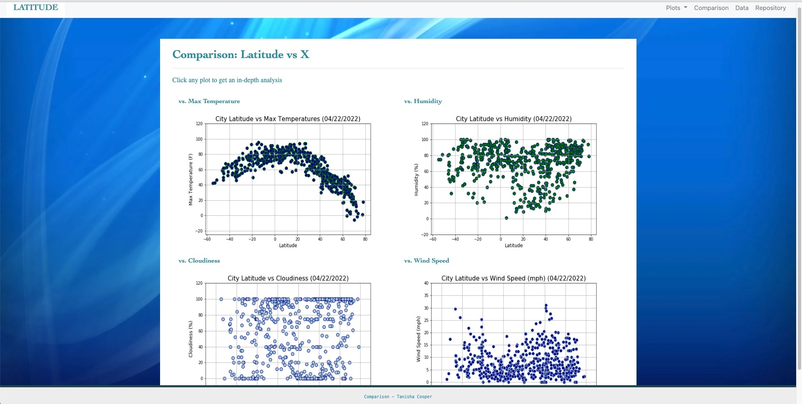
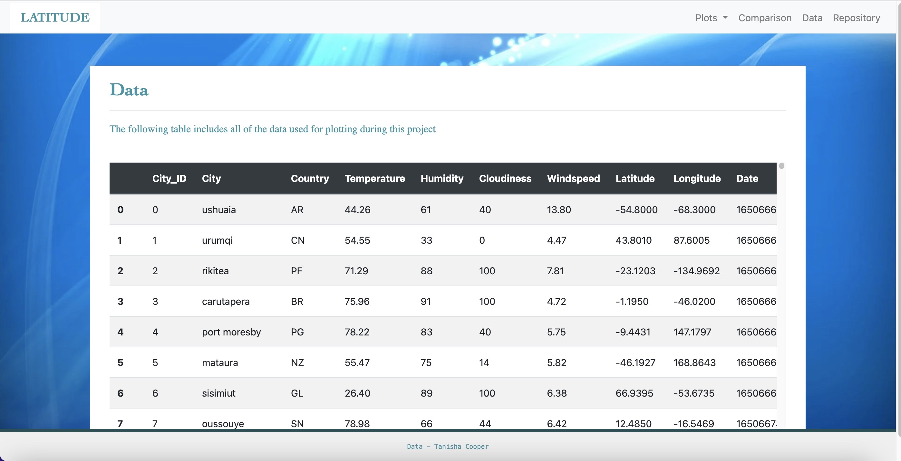

# Web-Design-Challenge: Web Visualization Dashboard
---

# Background

Data is more powerful when we share it others! We used what we've learned about **HTML** and **CSS** to create a dashboard featuring the analysis that we've done, as caputred in the following image:

# Web Design Challenge

The **Web Design Challenge** is where we created a webise using visualization that were created in the Python-API's Challenge: **Weather Data** and ***output_data_cities.csv***.

The Web Visualization Dashboard consists of individual pages for each plot and a way to navigate between them. The pages contain the [landing page](../Web-Design-Challenge/index.html), [viusalizations](../Web-Design-Challenge/visualizations/), [comparison of all plots](../Web-Design-Challenge/visualizations/comparison.html), and present [data](../Web-Design-Challenge/visualizations/data.html) used to build plots.

## Web Requirements

* Seven pages in total, including  

    * [Landing page](../Web-Design-Challenge/index.html) contiain the following elements:
        * Summary of the project
        * Links to each visualizations page with a sidebar containing preview images of each plot.
            * [Max Temperature](../Web-Design-Challenge/visualizations/temp.html)
            * [Humidity](../Web-Design-Challenge/visualizations/humidity.html) 
            * [Cloudiness](../Web-Design-Challenge/visualizations/cloudiness.html)
            * [Windspeed](../Web-Design-Challenge/visualizations/windspeed.html)
        * Each sidebar image takes the user to that visualization 
    
      

    * Four [Visualization page](../Web-Design-Challenge//visualizations/) that include the following elements:
        * Store all visualizations' html in "visualizations" folder
            * Each visualization contain:
                * Descriptive Title and Heading Tag
                * Plot or visualization for the selected comparison (Latitude vs: [Each Comparison](../Web-Design-Challenge/visualizations/comparison.html))
                * A paragraph desbring the plot and its significance.
    
    

    * [Comparison page](../Web-Design-Challenge/visualizations/comparison.html) that does the following:
        * Contain all of the visualizations on the same page so they can easily compare with each other
        * Use bootstrap grid for visualization
            * Grid must be two visualizations across medium and large screens, and it must be one visualization across on extra-small or small screens. 

    

    * [Data page](../Web-Design-Challenge/visualizations/data.html) display a responsive table containing the data used in the visualizations.
        * Table must be a Bootstrap table component.
        * Data must come from exporting the [output_data_cities.csv](../Web-Design-Challenge/Resources/output_data_cities.csv) as HTML using Panda (***to_html***)

    

    * Navigation Menu
        * Name of the sites on left of the navigation bar, which allows you to return to landing page (**Latitude**)
        * Dropdown menu on right named "**Plots**", which provides links to each visualization page
        * Two or more text links on right: "**Comparison**" that links to comparison page, "**Data**" which links to data page, and "**Repository**" which links to repository page
        * Responsive (using media queries)

    * Deployed to [GitHub Page - Tanisha Cooper](https://tanishacooper.github.io/Web-Design-Challenge/)

    * See [Images](Images) for additional responsive .png images
